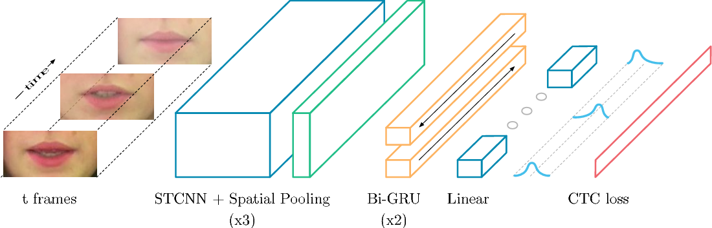
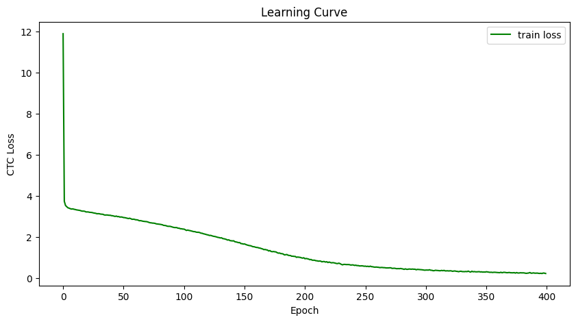
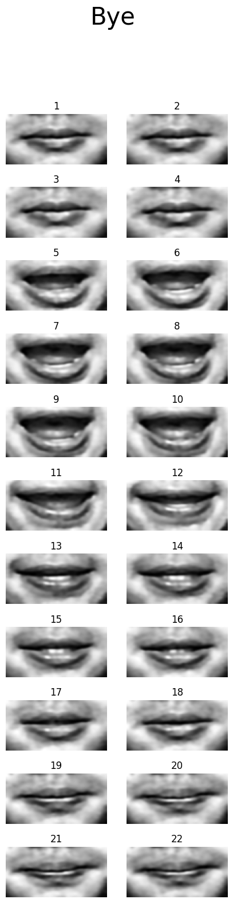
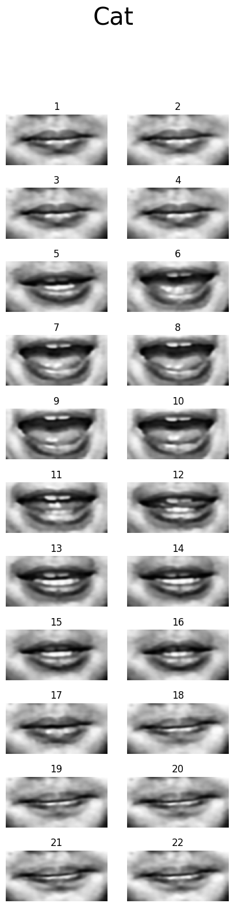
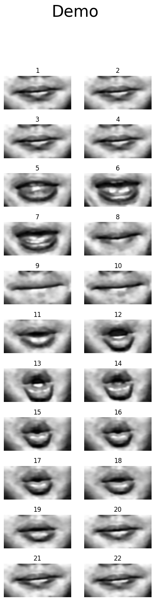
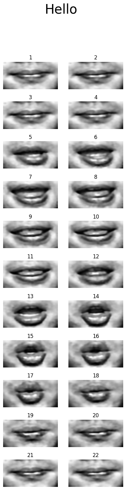
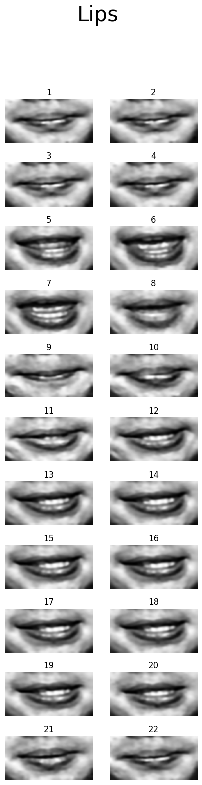

<p align="center">
  <h1 align="center">LipReading</h1>
</p>
<p align="center"><h3 align="center"2>Visual Speech Recognition using deep learing methods</h3></p>

<p align="center">
  <div align="center"></div>
  <div align="center"><figcaption><strong>Fig. 1: LipNet architecture.</strong></figcaption></div>
</p>

#### **Quick Links**
- [Dependencies](#Dependencies)
- [Getting Started](#Getting-Started)
- [Training](#Training)
- [DataSet](#DataSet)
- [References](#References)
- [License](#License)

## Dependencies
- Install Dependencies `$ pip install -r requirements.txt`
- Download Pretrained Weights [Here](https://huggingface.co/ordaktaktak/LipReading)

## Getting Started
- Project Structure
```
.
├── src
│   ├── nn
│   │   └── model.py
│   └── utils
│       ├── dataProvider.py
│       ├── labelConverter.py
│       ├── losses.py
│       ├── misc.py
│       ├── trainUtils.py
│       └── transforms.py
├── config.py
└── train.py
```
## Training
### CTC Loss
CTC takes a sequence $\ H = h_1 , . . . , h_T$ , where $\ T$ is the sequence length, and outputs the probability of $\ \pi$, which is defined as
```math
P(\pi|H) = \prod_{t = 1}^T y_{{\pi}_t}^t
```
where $\ y_{{\pi}_t}^t$ is the probability of generating character $\ \pi_t$ at each time step $\ t$.

<p align="center">
  <div align="center"></div>
  <div align="center"><figcaption><strong>Fig. 2: Model Training History.</strong></figcaption></div>
</p>

## DataSet
- You Can Find Dataset [Here](https://www.kaggle.com/datasets/allenye66/best-lip-reading-dataset)
<table>
  <tr>
      <td></img></td>
      <td></img></td>
      <td></img></td>
      <td></img></td>
      <td></img></td>
  </tr>
</table>

## References
- [LIPNET: End-to-End Sentence-Level Lipreading](https://arxiv.org/pdf/1611.01599.pdf)

## 🛡️ License <a name="license"></a>
Project is distributed under [MIT License](https://github.com/Saeed-Biabani/LipReading/blob/main/LICENSE)